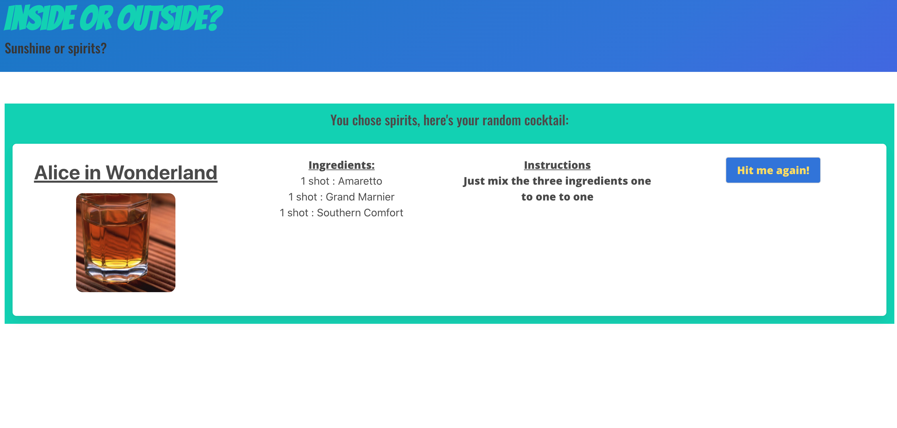

# Inside or Outside?

## Description

Are you bored? It's quarantine, so chances are likely. Enter: Inside or Outside? Choose between going outside or staying inside, and roll the dice.

If you want to get some fresh air, just enter your city and hit the Gimme sunshine! button. You'll get your 5-day weather forecast, so you can decide whether your excursion will be a shorts or pants situation.

If you didn't want to see the sun in the first place, you may choose the Gimme spirits! button. Or if you chose sunshine and the weather is subpar, click Bad weather? Let's drink. Both of these will give you a random cocktail to make for your indoor adventure, complete with name, picture, recipe, measurements, and instructions. The Hit me again! button will keep the random drinks (and the fun) flowing until the cows come home.

Link to site: https://ewirtz3.github.io/inside-or-outside/

## Table of Contents

- [Technologies](#technologies)
- [Usage](#usage)
- [License](#license)

## Technologies

- OpenWeather API
- TheCocktailDB API
- Bulma.io CSS framework
- Flexbox
- Moment.js
- Google Fonts

## Usage

Click the link above to go to the site. If you want to stay inside, click Gimme Spirits! to receive a random cocktail recipe. If you are feeling like some fresh air, input your city to get the 5-day weather forecast. If the weather looks gloomy, you can still get a random drink recipe by clicking Gimme Spirits!

## License

MIT License Copyright(c) 2020 <a href="https://github.com/ewirtz3">Emily Wirtz</a>, <a href="https://github.com/ChrisKramer15">Chris Kramer</a>, <a href="https://github.com/mac95860">Michael Cervantes</a>

If you have any questions, please contact me at GitHub username <a href="https://github.com/ewirtz3">ewirtz3</a>
